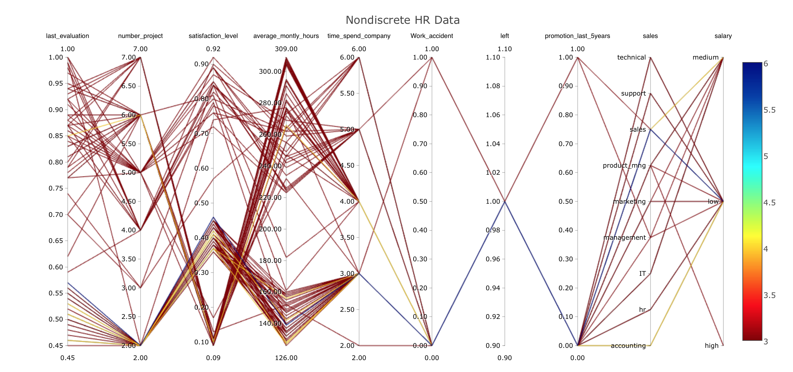
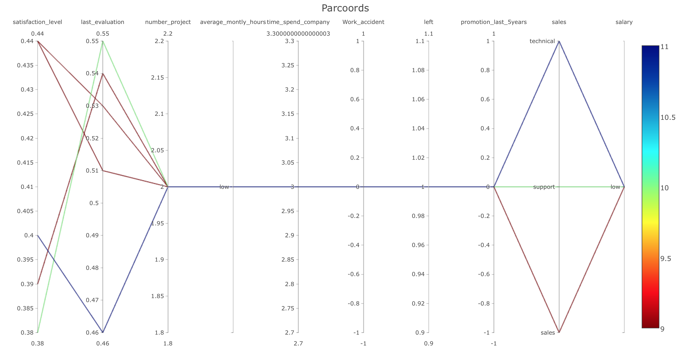
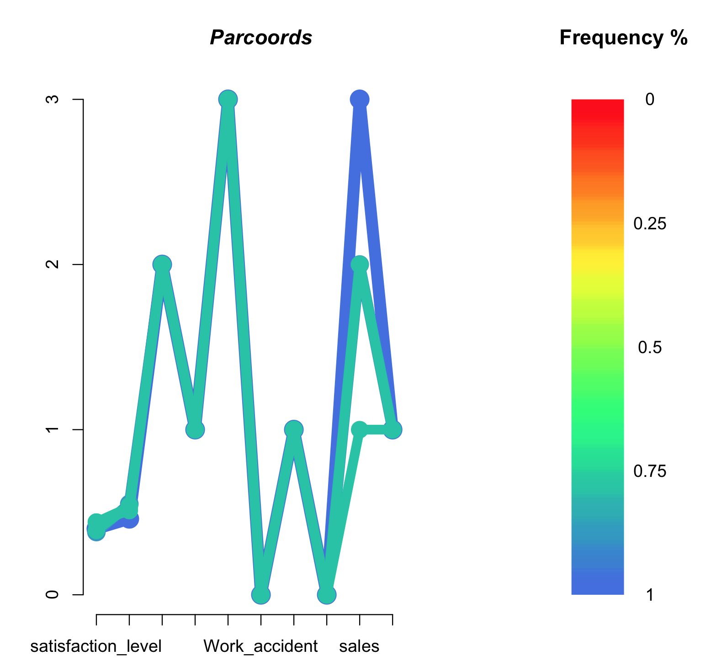
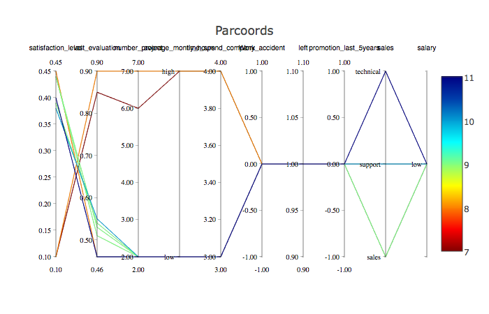
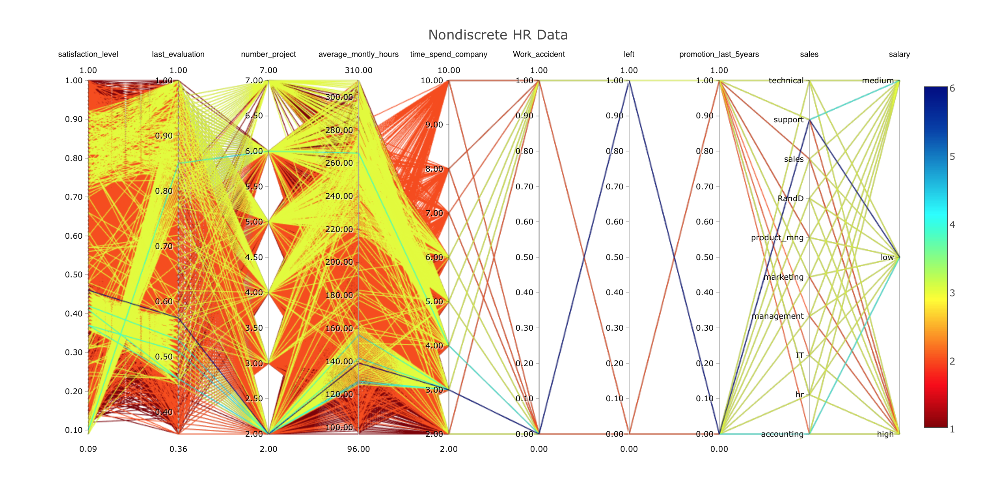
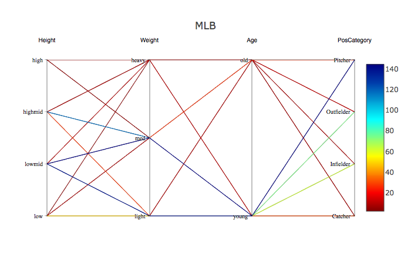

# cdparcoord:  Categorical and Discrete Parallel Coordinates

# Table of Contents
1. [Quickstart](#quickstart)
2. [Overview](#overview)
3. [Key Functions](#key-functions)
4. [Warnings](#warnings)
5. [Authors](#authors)

The *parallel coordinates* approach is a popular method for graphing
multivariate data.  However, for large data sets, the method suffers
from the "black screen problem" -- the jumble of lines fills the screen
and it is difficult if not impossible to discern any relationships in
the data.  Our solution is to graph only the most frequent lines.

Our **freqparcoord** package, aimed at continuous variables, with line
frequency defined in terms of estimated multivariate density.  The
current package, **cdparcoord**, covers the case of categorical
variables, with frequency defined as actual tuple count.  (In a mixed
continuous-categorical setting, the continuous variables are
discretized.)

# Quickstart

Here we give a quick view of the package operations.
It is assumed that the user has already executed

```R
library(cdparcoord)
```

##### Example

(UNDER REVISION.)

This involves the major league baseball player dataset **mlb**, included
in the package, courtesy of the UCLA Stat Dept.

```R
# load data
data(mlb)
mlb <- mlb[,4:7]  # focus on ht, wt, age and position
# discretize the continuous variables
inp1 <- list("name" = "Height", 
                      "partitions"=4, 
                      "labels"=c("low", "lowmid", "highmid", "high")) 
inp2 <- list("name" = "Weight", 
                      "partitions"=3, 
                      "labels"=c("light", "med", "heavy")) 
inp3 <- list("name" = "Age", 
                      "partitions"=2, 
                      "labels"=c("young", "old")) 
# create one list to pass everything to discretize() 
discreteinput <- list(inp1, inp2, inp3) 
# do the discretization
discretizedmlb <- discretize(mlb, discreteinput) 

# run the plot
discparcoord(discretizedmlb,k=100) 
```

Here we are requesting that the 100 most frequent tuples be displayed, 
with the frequencies color-coded.

Start at the far-left column, for instance, we see a line corresponding
to Height = highmid, Weight = heavy, Age = young and PosCategory =
Catcher.



(In this example all the variables are continuous, but we have not
discretized the data.)

Here we have displayed the **k** = 100 most frequent patterns.  The
color legend at the right shows frequency.  Since the highest frequency
was 6, we might consider trying a larger value of **k**.

The package is built on top of **plotly**, which allows us to change the
order of the columns via mouse drag.  We could, for instance, use the
mouse to move the salary column more to the center or left, by clicking
and dragging the label 'salary' to the desired spot. 

Here, we can see, for example, that higher satisfaction level is 
associated with having more projects and more monthly hours, until 
number of projects or number of monthly hours is too high, in which 
case satisfaction level drastically drops.  

##### Categorical-Data Examples ([C1](#example-c1), [C2](#example-c2), [C3](#example-c3))

###### Example C1

Here we will discretize two of the continuous variables, and show the
effects of the categorical variable Job Type.

```R
# Load data
data(hrdata)

input1 <- list("name" = "average_montly_hours", "partitions" = 3, "labels" = c("low", "med", "high"))
input <- list(input1)
# This will discretize the data by partitioning average monthly hours into 3 parts
# called low, med, and high
hrdata <- discretize(hrdata, input)

# account for NA values and plot with parallel coordinates
discparcoord(hrdata)                                  # plot c1
```

C1: 


Here the various job categories exhibit rather similar behavior, but it
is interesting that the Technical workers have slightly higher job
satisfaction in spite of having somewhat lower performance ratings.

###### Example C2

```R
# same as above, but with scrambled columns
# By default, interactive plotting allows you to drag around columns
# to scramble them, but we may use permute to scramble columns in 
# non-interactive plotting as well.
discparcoord(hrdata, permute=TRUE, interactive=FALSE)  # plot c2
```
C2: 


###### Example C3
```R
# same as above, but show top k values, title,  and interactive plot
discparcoord(hrdata, k=8, name="Plot C3")           # plot c3
```

C3: 

```R
# same as above, but group according to profession
# This will create 11 different plots, 1 for each profession
discparcoord(hrdata, grpcategory="sales") 
```

---

# Overview

The **cdparcoord** package was created to serve as a parallel
coordinates graphing package with special focus on the black screen
problem, dealing with categorical variables, and the NA problem. 

It builds upon the [`freqparcoord` package](https://cran.r-project.org/web/packages/freqparcoord/index.html).

### The Black Screen Problem
The black screen problem occurs when there are too many data points to
plot. This results in a complete black screen from which no useful
information may be gleaned. 

This is solved in [`freqparcoord`](https://cran.r-project.org/web/packages/freqparcoord/index.html)
by displaying on the most frequent relations. We account for this here by showing the most significant 
tuples.

Before: 

```R
# Load data
data(hrdata)
discparcoord(hrdata, k=10000, name="Nondiscrete HR Data")
```



After: 

```R
# Load data
library(cdparcoord)
data(hrdata)
discparcoord(hrdata, interactive=TRUE, k=100, name="Nondiscrete HR Data")
```


The second plot is much simpler and significant relationships are much
more visible.  Note that the relationship between satisfaction level and
number of projects and the relationship between satisfaction level and
number of monthly hours is more easily recognizable in the second plot.
Higher satisfaction level here is shown to be associated with having
more projects and more monthly hours, until a clear limit at which the
employee has too many projects or has to work too many hours.  In this
case, satisfaction level drastically drops. 


### Accounting for NA Values

R and R packages typically leave out any rows with NA
values. Unfortunately for data sets with high NA counts, this may have
drastic effects, such as low counts and possible bias. 
[`cdparcoord`](https://github.com/matloff/cdparcoord) addresses this
issue by allowing these rows to contribute to overall counts, but to
lesser extents.

### Discretizing Data

Sometimes, you want to use discrete data for your parallel coordinates
plot. This allows you to more easily recognize trends. This can be done
with `discretize()`.

###### Before: 

```R
library(cdparcoord)
# load freqparcoord to get the mlb data set
library(freqparcoord)
data(mlb)
# Get the Height, Weight, Age, and Position of Players
m <- mlb[,4:7]
# Account for NA values and weigh values; interactively plot; take top 1000 tuples
discparcoord(m, k=1000)
```


###### After: 

Using categorical variables with the mlb data set with `discretize()`
and interactive plotting, with the most significant 1000 tuples.

```R
library(cdparcoord)
# load freqparcoord to get the mlb data set
library(freqparcoord)
data(mlb)
# Get the Height, Weight, Age, and Position of Players
m <- mlb[,4:7]

inp1 <- list("name" = "Height",
             "partitions"=4,
             "labels"=c("low", "lowmid", "highmid", "high"))

inp2 <- list("name" = "Weight",
             "partitions"=3,
             "labels"=c("light", "med", "heavy"))

inp3 <- list("name" = "Age",
             "partitions"=2,
             "labels"=c("young", "old"))

# Create one list to pass everything to discretize()
discreteinput <- list(inp1, inp2, inp3)

# At this point, all of the data has been discretized
discretizedmlb <- discretize(m, discreteinput)

# Account for NA values and weigh values; interactively plot; take top 1000 tuples
discparcoord(discretizedmlb, name="MLB", k=1000)
```



Discretized, it is easier to see that pitchers are typically younger, and 
shorter people typically weigh less. 

# Key Functions

#### `discparcoord()`
The main function is `discparcoord()`, which may optionally be used with `discretize()`.
`discparcoord()` accounts for partial values and drawing.

#### `discretize()`
`discparcoord()` may optionally be used with `discretize()`.

`discretize` takes a dataset and a list of lists. It discretizes the
dataset's values such that `plot()` may chart categorical variables.
The inner list should contain the following variables: `int partitions`,
`string vector labels`, `vector lower bounds`, `vector upper bounds`.
The last three are optional.

#### `discparcoord()` details

Encompassed in discparcoord, we provide 3 key functions -- `partialNA()`
`grpcategory()`, and `interactivedraw()`.

1. The call `partialNA(dataset,n)` inputs a dataset and returns a new
   dataset consisting of the **n** most frequent patterns with an added
   column - the frequency of each column.  This dataset contains no NA
   values, as all of the columns previously with NA values have now been
   eliminated. 

   By default, `partialNA` returns the 5 most significant tuples.

2. The `grpcategory` option allows you to create multiple plots, one for
   each category. If a field has 4 possible values, then
   `discparcoord()` with the `grpcategory` option will create a plot for
   each category, where each plot has the specific category's
   attributes.

   For example, if a field "Weight "has "Heavyweight" and "Lightweight",
   then this will create one plot where all tuples are heavyweights,
   then one more where where all tuples are lightweights.

3. `interactivedraw()` takes a dataset and draws a parallel coordinates plot 
   that opens in your browser. It has movable columns, brushing, and the ability
   to save your plots. You can also choose to toggle labels on and off. 
   For more information, type `?interactivedraw` into the console.

# Tips

Like any exploratory graphical tool, **cdparcoord** is best used by
trying various parameter values.

1. By default, `partialNA()` returns the five most frequent
   correlations. If there is low/no correlation between variables, then
   this may be misleading.

2. Due to the limited size of screens compared to the number of
   variables in many data sets, we recommend subsetting input data to
   only include relevant variables prior to using the package.

3. Sometimes labels greatly hinder the visibility and clarity of the
   plot. This can be circumvented by opting to remove labels in plot.

4. Categorical data is currently scaled by 1, starting from 1. When
   placed on the same axis as numerical data with high values (ex:
   100+), it can be difficult to differentiate between categories when
   used with `draw()`. This does not occur with `interactivedraw()`.

# Authors

Norm Matloff, Harrison Nguyen, Vincent Yang
