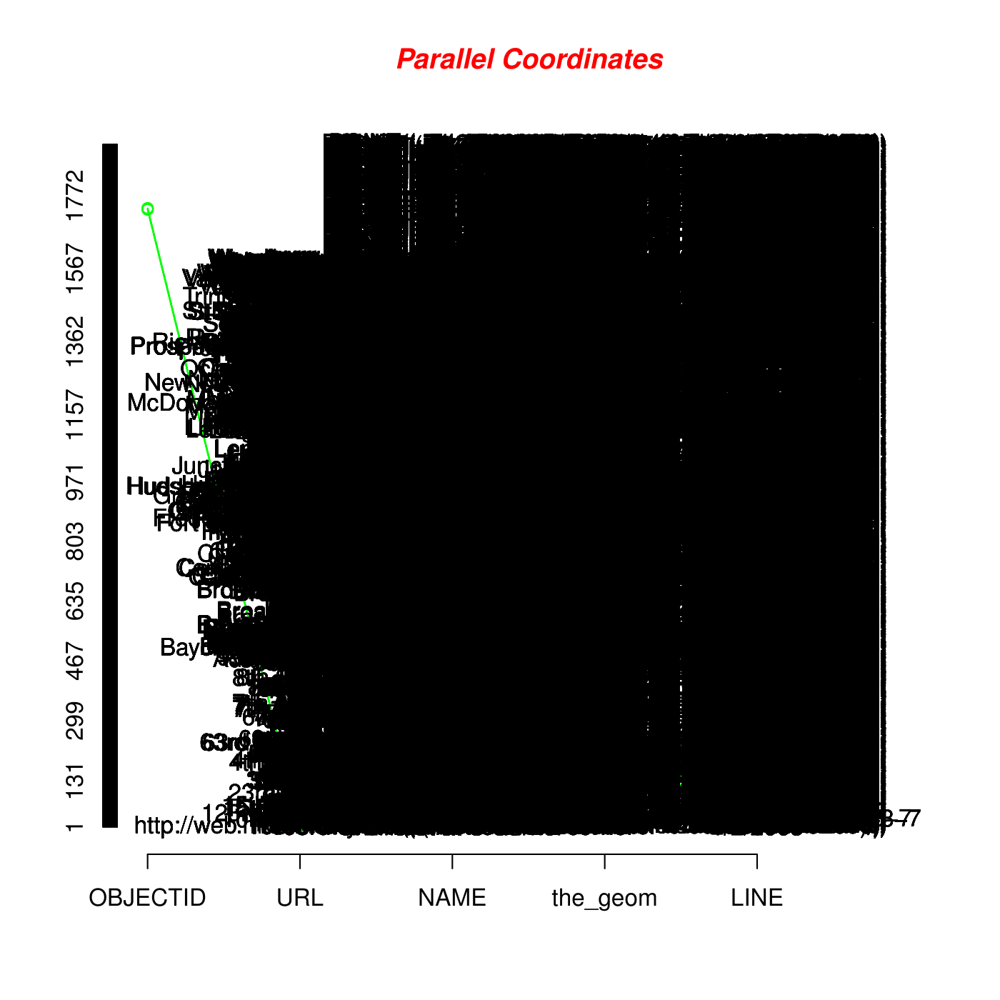

# freqparcoord.cd

### About
*freqparcoord.cd* was created to serve as a parallel coordinates graphing package with special
focus on the black screen problem and the NA problem. Fundamentally, R and R packages typically
leave out any rows with NA values. Unfortunately for data sets with high NA counts, this may have drastic
effects. We address this issue by allowing these rows to contribute to overall counts, but to lesser extents.
The black screen problem occurs when there are too many data points to plot. This results in a complete
black screen from which no useful information may be gleaned. We solve this by allowing the user to 
take the n most significant relations.  



### Instructions
We provide 3 key functions - `partialNA()`, `draw()` and `discretize()`.
`partialNA` takes a dataset and returns a dataset with an added column - the frequency of each column.
This dataset contains no NA values, as all of the columns previously with NA values 
have now been eliminated. 

`draw` takes a dataset and draws a parallel coordinates plot in the same directory. It
also takes a name for the name of the plot, and a choice for whether or not to have labels. When there are 
many data points, the labels are unreadable and for these times it is better to leave labels off. The default is 
to have labels on. 

`discretize` takes a dataset and a list of lists. It discretizes the dataset's values such that `plot()` may chart 
categorical variables.
The inner list should contain the following variables: `int partitions`, `string vector labels`, `vector lower bounds`, 
`vector upper bounds`. The last three are optional.

### Implementation

### Warnings
1. By default, `partialNA()` returns the five most frequent correlations. If there is low/no correlation between 
variables, then this may be misleading.
2. Due to the limited size of screens compared to the number of variables in many data sets, we recommend subsetting 
input data to only include
relevant variables prior to using the package.
3. Sometimes labels greatly hinder the visibility and clarity of the plot. This can be circumvented by opting to remove 
labels in plot.
4. Categorical data is currently scaled by 1, starting from 1. When placed on the same axis as numerical data with high 
values (ex: 100+), it can
be difficult to differentiate between categories.

### Example
1. A small example of parallel coordinates plotting
2. Categorical Variables

##### 1. A small example of parallel coordinates plotting
```R
library(freqparcoord.cd)
smallexp <- smallexample()
draw(smallexp) # opens the plot
```

Alternatively substitute the last line with 
```R
draw(smallexp, "smallexample.pdf")
```
for a saved file output instead.

##### 2. Categorical Variable Example

### Authors
Norm Matloff, Harrison Nguyen, Vincent Yang
