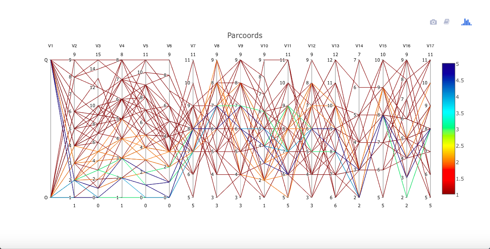

---
title: 'cdparcoord: Categorical and Discrete Parallel Coordinates'
author: "Norm Matloff, Vincent Yang and Harrison Nguyen"
date: "`r Sys.Date()`"
output: rmarkdown::html_vignette
vignette: >
  %\VignetteIndexEntry{Vignette Title}
  %\VignetteEngine{knitr::rmarkdown}
  %\VignetteEncoding{UTF-8}
---

# cdparcoord:  Categorical and Discrete Parallel Coordinates

# Table of Contents

* [Motivation](#Motivation)
* [Quickstart](#quickstart)
* [Examples](#examples)
* [Key Functions](#key-functions)
* [Tips](#tips)
* [Authors](#authors)

# Motivation

The [*parallel coordinates*
approach](https://en.wikipedia.org/wiki/Parallel_coordinates) is a
popular method for graphing multivariate data.  However, for large data
sets, the method suffers from a "black screen problem" -- the jumble of
lines fills the screen and it is difficult if not impossible to discern
any relationships in the data.  

Consider the package dataset **mlb**, consisting of data on Major League
Baseball players, courtesy of the UCLA Stat Dept.

```R
data(mlb)
# extract height, weight, age
m <- mlb[,4:6]
# ordinary parallel coordinates 
library(MASS) 
parcoord(m) 
```


Each polygonal line in the graph represents one player, connecting his
height, weight and age.  If a player had his (height,weight,age) tuple
as, say (73,192,25), his line would have height 73 on the Height axis,
height 192 on the Weight axis and height 25 on the Age axis.  But since
there are so many lines (actually only about 1000), the graph is
useless.


Our solution is to graph only the most frequent lines.  Our
[**freqparcoord**
package](https://cran.r-project.org/package=freqparcoord)
does this for continuous variables, with line frequency defined in terms
of estimated multivariate density.  The current package,
[**cdparcoord**](https://github.com/matloff/cdparcoord), covers the case
of categorical variables, with frequency defined as actual tuple count.
(In a mixed continuous-categorical setting, the continuous variables are
discretized.)

# Quickstart

Here we give a quick view of the package operations.
It is assumed that the user has already executed

```R
library(cdparcoord)
```

## Example:  Gender pay difference

This example involves data from the 2000 U.S. census on programmers and
engineers in Silicon Valley, a dataset included with the package.

Suppose our interest is exploring whether women encounter wage
discrimination.  Of course we won't settle such a complex question here,
but it will serve as a good example of the use of the package as an
exploratory tool.

We first load the data, and select some of the columns for display.  (In
this tutorial, the terms *column* and *variable* will be used
interchangeably, and will have the same meaning as *feature*.) We also
remove some very high wages (at least in the context of the year 2000)
to make the display easier.

```R
data(prgeng)
pe <- prgeng[,c(1,3,5,7:9)]
pe25 <- pe[pe$wageinc < 250000,]
```

The resulting data has just under 20,000 rows.

As mentioned, a key feature of the package is discretization of
continuous variables, so that the tuple frequency counts will have
meaning. We will do this via the package's **discretize()** function,
which we will apply to the numeric variables.

However, in this particular data set, there are variables that seem
numeric but are in essence factors, as they are codes.  For the **educ**
variable, for instance, the number 14 codes a master's degree. (A code
list is available at the [Census Bureau
site](https://www.census.gov/prod/cen2000/doc/pums.pdf).)

So, let's change the coded variables to factors, and then discretize:

```R
pe25 <- makeFactor(pe25,c('educ','occ','sex'))
pe25disc <- discretize(pe25,nlevels=5)  
```

Each of the numeric variables here is discretized into 5 levels.

Now display:

```R
discparcoord(pe25disc,k=150)  
```

Here we are having **cdparcoord** display the 150 most frequent tuple
patterns. The result is


For example, there is a blue line corresponding to the tuple,

(age=35,educ=14,occ=102,sex=1,wageinc=100000,wkswrkd=52)

The frequencies are color-coded according to the legend at the right. So
the above tuple occurred something like 60 times in the data.

What about the difference between males and females (coded 1 and 2)?
One interesting point is that there seems to be greater range in the
men's salaries.  At the high end, though, men seem to have the edge.

Now, can that edge may be explained by differences between
the two groups in other variables?  For instance, do women tend to be in
lower-paying occupations?  To investigate that, let's move the **occ**
column to be adjacent to **wageinc**.

This is accomplished by a mouse operation that is provided by **plotly**,
the graphical package on top of which **cdparcoord** is built.
Specifically, we can use the mouse to drag the **occ** label to the
right, releasing the mouse when the column reaches near the **wageinc**
column.  The result is


As noted, there is a range for each occupation. However, looking at the
more-frequent lines, occupation 102 seems to rather lucrative (and
possibly 140 and 141).  And if so, that seems to be bad news for the
women, as occupation 102 seems more populated by men.  On the other
hand, this might help explain the high-end salary gender gap found above.
Another possible piece of evidence in this direction is that the graph
seems to say the men tend to have higher levels of education.

To obtain a somewhat finer look, we can use another feature supplied by
**plotly**, a form of *brushing*. Here we highlight the women's lines by
using the mouse to drag the top of the **sex** column down slightly.
This causes the men's lines to go to light gray, while the women's lines
stay in color:


The fact that we requested brushing for **sex** = 2 is confirmed in the
graph by the appearance of a short magenta-colored line segment just
below the 2 tick mark.

Multiple columns can be brushed together.  To turn off brushing, click
on a non-magenta portion of the axis.


# Further Examples

The following examples will illustrate other features of the package, as
well as different applications.

## Example: Node reordering, advanced brushing

Here we try the [Stanford WordBank
data](http://wordbank.stanford.edu/analyses?name=instrument_data) on
vocabulary acquisition in young children.  The file used was
**English.csv**, from which we have a data frame **wb**, consisting of
about 5500 rows.  (There are many NA values, though, and only about 2800
complete cases.)  Variables are age, birth order, sex, mother's
education and vocabulary size.

```R
wb <- wb[,c(2,5,7,8,10)] 
wb <- discretize(wb,nlevels=5) 
discparcoord(wb,k=100) 
```

We again asked for 5 levels for each variable.  As noted in the [Tips
section](#tips) below, though, **cdparcoord**, like any graphical
exploratory tool, is best used by trying a number of different parameter
combinations, e.g.  varying **nlevels** here.

This produces


Nice -- but, presuming that **mom\_ed** has an ordinal relation with
vocabulary, the ordering of the labels here is not what we would like.
We can use **reOrder** to remedy that:

```R
wb <- reOrder(wb,'mom_ed',
   c('Secondary','Some College','College','Some Graduate','Graduate'))
discparcoord(wb,k=100)
```


By the way, there were further levels in the **mom\_ed** variable,
'Primary' and 'Some Secondary', but they didn't show up here, as we
plotted only the top 100 lines. (Or we set **nlevels** at a higher value
than might be effective for this data.) There was a similar issue with
missing levels on **birth\_order**.

Speaking of the latter, the earlier-born children seem to be at an
advantage, at least in the two orders that show up here.

Now suppose we wish to study girls with mothers having at least a
college education. Again we can use brushing, this time with two
variables **sex** and **mom\_ed** together, and several values together
in the latter variables: 


The magenta highlights show that **sex** and **mom\_ed** were brushed,
and in the latter case, specifically the levels 'College', 'Some Graduate' and
'Graduate'.  Lines with all other combinations now appear in light gray.

## Example: Advanced use of discretize()

We return to the baseball, and show a more advanced usage of
**discretize()**.  The dataset is probably too small to discretize --
some frequencies of interesting tuples will be very small -- but it is a
good example of usage of lists in **discretize()**. 

The key argument is **input**, which will be an R list of lists.  In the
outer list, there will be one inner list for each variable to be
specified for discretization.

```R
inp1 <- list("name" = "Height",
             "partitions"=3,
             "labels"=c("short", "med", "tall"))
inp2 <- list("name" = "Weight",
             "partitions"=3,
             "labels"=c("light", "med", "heavy"))
inp3 <- list("name" = "Age",
             "partitions"=2,
             "labels"=c("young", "old"))
discreteinput <- list(inp1, inp2, inp3)
discretizedmlb <- discretize(m, discreteinput)
discparcoord(discretizedmlb, name="MLB", k=100)
```


Had we wanted to handle **Height** separately, we could have called
**discretize()** twice:

```R
inpt <- list(inp2,inp3) 
m1 <- discretize(m,inpt) 
m2 <- discretize(m1) 
discparcoord(m2,k=150) 
```

## Example: Outlier hunting

As with **freqparcoord** for the continuous-variable case,
**cdparcoord** may be used for identifying outliers.  This is
accomplished by setting a negative value for the argument **k** in
**discparcoord()**.  Here we took **k** = -10, i.e. asked to plot the 10
LEAST frequent tuples:

```R
data(PimaIndiansDiabetes) 
pima <- PimaIndiansDiabetes 
discparcoord(pima,k=-10) 
showCounts() 
```


There is an interesting case of a woman who has high values on almost
all the risk factors, and does indeed have diabetes.  That one may be a
correct data point (though possibly a candidate for exclusion in formal
statistical analysis), but the case in which Thick, Insul and BMI are
all 0s is clearly an error.  

Let's investigate this further, by examining the actual tuples:

```
> showCounts()
   pregnant glucose pressure triceps insulin mass pedigree age diabetes freq
1         6     148       72      35       0 33.6    0.627  50      pos    1
2         1      85       66      29       0 26.6    0.351  31      neg    1
3         8     183       64       0       0 23.3    0.672  32      pos    1
4         1      89       66      23      94 28.1    0.167  21      neg    1
5         0     137       40      35     168 43.1    2.288  33      pos    1
6         5     116       74       0       0 25.6    0.201  30      neg    1
7         3      78       50      32      88 31.0    0.248  26      pos    1
8        10     115        0       0       0 35.3    0.134  29      neg    1
9         2     197       70      45     543 30.5    0.158  53      pos    1
10        8     125       96       0       0  0.0    0.232  54      pos    1
```

So, in addition to the triple-0 case, there are several with double 
0s and one with a single 0.  There are probably more in the rest of the data.  
We see that there is serious need for data cleaning here.

## Example: Time series

Consider the [ozone
data](https://archive.ics.uci.edu/ml/datasets/Ozone+Level+Detection) in
the UCI Machine Learning Data Repository.  We will use the file
**onehr.data**, which gives hourly readings of ozone and other values
over the coure of a day.  There is one row per day, during the time
period 1998-2004.

The missing values are coded as question marks in the dataset, so we'll
remove any case with such a value.  Also, to make the display easier to
view, we'll look only a readings every four hours.  We will also include
the midday temperature:

```R
oz <-
   read.csv('https://archive.ics.uci.edu/ml/machine-learning-databases/ozone/onehr.data',header=FALSE)
noq <- function(rw) !any(rw == '?') 
goodrows <- apply(oz,1,noq) 
ozc <- oz[goodrows,] 
for(i in 1:74) ozc[,i] <- as.numeric(as.character(ozc[,i]))
ozc4 <- ozc[,c(seq(2,25,4),39)]
ozc4d <- discretize(ozc4,nlevels=3)
discparcoord(ozc4d,k=25)

```

The result is


Apparently on hot days, a high ozone level at the start of a day will
persist as the day goes on.  However, on cooler days, there may be some
oscillation.  As is often the case, we would need a domain expert to
interpret this, but the point is that we have discovered something for
him/her to investigate.

## Example: Classification problems

The package can be used in an exploratory manner for feature selection
in classification problems.  This can be useful, for instance, for
identifying sets of good predictors.

Let's look at the Letter Recognition dataset from the UCI Machine
Learning Repository.  Images were generated for the 26 capital letters
in English, various fonts, some randomly-generated distortion.  Various
physical and statistical numerics were recorded for each image.

One might expect the letters O and Q to be more difficult to tell apart.
Let's view that using **cdparcoord**.  By the way, no need to discretize
here, as all values are integers.

```R
ltr <-
read.csv('https://archive.ics.uci.edu/ml/machine-learning-databases/letter-recognition/letter-recognition.data',header=FALSE) 
oq <- ltr[ltr[,1]=='O' | ltr[,1]=='Q',] 
discparcoord(oq,k=100) 
```



A little daunting!  Yet even for these two similar letters, it appears
for instance that variables V2 through V6 may have some predictive power
to distinguish between the two letters.  Brushing the Q node makes this
a little clearer (not shown here).

## Example: Rare subsgroups

Since (for positive **k**) we only display the most-frequent tuples, we
may missing small but important subgroups.  This may especially be a
problem in classification applications, with one or more small classes.

For that reason, **cdparcoord** provides a mechanism with which the user
can specify that a given subgroup be given extra weighting in the
frequency counting.

Let's use the Census data to illustrate this.  If in the previous graph
above for this dataset one brushes both **educ** = 16 and **sex** = 2,
i.e. female PhDs, one finds that all lines are gray! There were actually
102 people of that type in the data, but that wasn't popular enough to
make the cut. 

Instead, one can run

```R
discparcoord(pe25disc,k=150,
   accentuate='with(pe25disc,educ==16 & sex==2)') 
```

which specifies to give extra weight (default value 100) to this group.

## Example: Comparison to full parallel coordinates

Finally, let's look at the the Diamonds example bundled with the
**ggplot2** package (in turn bundled by **plotly**, which is loaded by
**cdparcoord**).  We'll borrow from [this Luke Tierney course example](https://registrar.stanford.edu/resources-and-help/stanford-academic-calendar#Aut).
This particular example uses the **lattice** graphics library.

First, the data prep.  The example "thins out" the data by taking a
subsample:

```R
library(lattice)
ds <- diamonds[sample(nrow(diamonds), 5000),]
parallelplot(~ds, group = cut, data = ds, horizontal.axis = FALSE,
             auto.key = TRUE)
```


It's a pretty picture, all right, but hard to follow, say for the
Premium diamonds.

Let's try **cdparcoord**, using the full data set of course, though as
usual only the most-frequent tuples:

```R
dd <- discretize(diamonds,nlevels=4) 
discparcoord(dd,k=2500) 
```


It is definitely easier to discern the patterns here than above.  Look
for instance at the blue lines for the Premium quality.


# Key Functions

#### `discparcoord()`
The main function is `discparcoord()`, which may optionally be used with `discretize()`.
`discparcoord()` accounts for partial values and drawing.

#### `discretize()`
`discparcoord()` may optionally be used with `discretize()`.

`discretize` takes a dataset and a list of lists. It discretizes the
dataset's values such that `plot()` may chart categorical variables.
The inner list should contain the following variables: `int partitions`,
`string vector labels`, `vector lower bounds`, `vector upper bounds`.
The last three are optional.

#### `discparcoord()` details

Encompassed in **discparcoord**, we provide 3 key functions -- `tupleFreqs()`
`grpcategory()`, and `interactivedraw()`.

1. The call `tupleFreqs(dataset,n)` inputs a dataset and returns a new
   dataset consisting of the **n** most frequent patterns with an added
   column - the frequency of each column.  This dataset contains no NA
   values, as all of the columns previously with NA values have now been
   eliminated. 

   By default, `tupleFreqs` returns the 5 most significant tuples.

2. The `grpcategory` option allows you to create multiple plots, one for
   each category. If a field has 4 possible values, then
   `discparcoord()` with the `grpcategory` option will create a plot for
   each category, where each plot has the specific category's
   attributes.

   For example, if a field "Weight "has "Heavyweight" and "Lightweight",
   then this will create one plot where all tuples are heavyweights,
   then one more where where all tuples are lightweights.

3. `interactivedraw()` takes a dataset and draws a parallel coordinates plot 
   that opens in your browser. It has movable columns, brushing, and the ability
   to save your plots. You can also choose to toggle labels on and off. 
   For more information, type `?interactivedraw` into the console.

# Tips

* Like any exploratory graphical tool, **cdparcoord** is best used by
  trying various parameter values, e.g. different values of **k**,
  **nlevels** and so on, one then just one combination of settings..

* Pay close attention to the frequency color-coding.  For instance, 
  if the lines are all green, this means the frequencies are all about the
  same, likely 1. In such case, you may wish to use **discretize()** with 
  a small value of **nlevels**.

* On the other hand, there are situations in which one may not wish to
  discretize, such as:

  - When searching for outliers (negative **k**), the cases of interest
    will typically have frequency 1 and in any event the frequency may
    not be of interest here.

  - With a large number of variables, even a value of 2 for **nlevels**
    will result in frequencies of 1, so it may be better not to
    discretize in the first place.  Actually, **freqparcoord** may be
    more useful here.

* Sometimes labels greatly hinder the visibility and clarity of the
  plot. This can be circumvented by opting to remove labels in plot.

* Sometimes two lines will coincide in one or more segments.  Brushing
  may help separate them.

# Accounting for NA Values

(EXPERIMENTAL, MAY BE VERY SLOW)

R and R packages typically leave out any rows with NA
values. Unfortunately for data sets with high NA counts, this may have
drastic effects, such as low counts and possible bias. 
[`cdparcoord`](https://github.com/matloff/cdparcoord) addresses this
issue by allowing these rows to partially contribute to overall counts.
See the **NAexp** variable in **tupleFreqs()**.

# Authors

Norm Matloff, Vincent Yang, Harrison Nguyen
